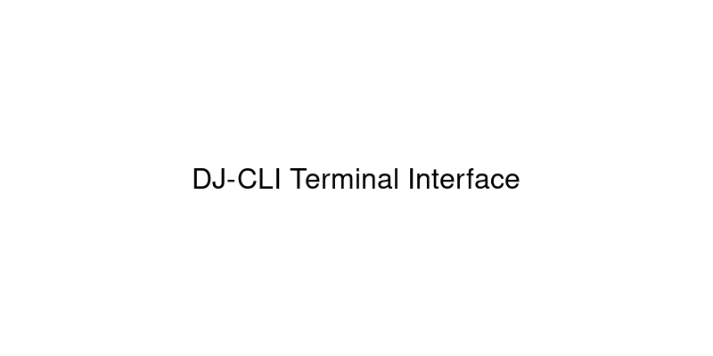

<p align="center">
  
</p>

<h1 align="center">DJ-CLI</h1>
<h2 align="center">Professional Terminal Interface for YouTube MP3 Downloads</h2>

<p align="center">
  <a href="https://crates.io/crates/dj-cli">
    
  </a>
  <a href="https://docs.rs/dj-cli">
    
  </a>
  <a href="https://github.com/henryoman/dj-cli/actions">
    
  </a>
  <a href="https://github.com/henryoman/dj-cli/stargazers">
    
  </a>
  <a href="./LICENSE">
    
  </a>
</p>

---

## Interface Preview

<p align="center">
  
</p>

Example of the terminal interface displaying status information and keyboard controls.

---

## Features

### Core Functionality
- **Efficient downloads** using the [`yt-dlp`](https://github.com/yt-dlp/yt-dlp) backend
- **High-quality audio extraction** supporting 128kbps and 256kbps MP3 output
- **URL extraction** from clipboard text
- **Asynchronous operations** with real-time progress updates

### Terminal User Interface
- **Terminal interface** powered by [`ratatui`](https://ratatui.rs)
- **Responsive layout** that adapts to terminal size
- **Real-time status updates** with download progress and error handling
- **Keyboard navigation** with intuitive controls
- **Focus management** for consistent user experience

### Reliability & Performance
- **Robust error handling** - graceful failures that don't crash the interface
- **Input sanitization** - automatically cleans and validates pasted content
- **Memory-safe operations** with input length limits and cleanup
- **Cross-platform support**: macOS, Linux, Windows (via WSL)
- **Zero external dependencies** beyond yt-dlp and ffmpeg

### File Management
- **Automatic organization** - downloads save directly to your Downloads folder
- **Metadata embedding** - includes thumbnails and track information
- **Filename sanitization** - handles special characters and long titles
- **Duplicate detection** - smart handling of existing files

---

## Quick Start

### Installation Options

#### Option 1: Install from Crates.io (Recommended)
```bash
cargo install dj-cli
```

#### Option 2: Build from Source
```bash
git clone https://github.com/henryoman/dj-cli.git
cd dj-cli
cargo build --release
cargo install --path .
```

#### Option 3: Run Directly
```bash
git clone https://github.com/henryoman/dj-cli.git
cd dj-cli
cargo run --release
```

### First Run
```bash
# Launch the interactive TUI
dj-cli

# Or download directly (non-interactive)
dj-cli "https://www.youtube.com/watch?v=dQw4w9WgXcQ"
```

---

## Prerequisites & Dependencies

### Required Software

#### 1. Rust Toolchain
DJ-CLI requires **Rust 1.78 or later**. Install via [`rustup`](https://www.rust-lang.org/tools/install):

```bash
curl --proto '=https' --tlsv1.2 -sSf https://sh.rustup.rs | sh
source ~/.cargo/env
```

#### 2. yt-dlp (Core Download Engine)
Install the latest version of yt-dlp:

```bash
# macOS (Homebrew)
brew install yt-dlp

# Ubuntu/Debian
sudo apt update && sudo apt install yt-dlp

# Arch Linux
sudo pacman -S yt-dlp

# Or via pip (universal)
pip install yt-dlp
```

#### 3. FFmpeg (Audio Processing)
Required for audio extraction and format conversion:

```bash
# macOS (Homebrew)
brew install ffmpeg

# Ubuntu/Debian
sudo apt update && sudo apt install ffmpeg

# Arch Linux
sudo pacman -S ffmpeg

# Windows (Chocolatey)
choco install ffmpeg
```

### Verification
Test your setup:
```bash
yt-dlp --version
ffmpeg -version
cargo --version
```

---

## Comprehensive Usage Guide

### Single Download Mode

1. **Launch DJ-CLI**
   ```bash
   dj-cli
   ```

2. **Paste YouTube URL**
   - Simply paste any YouTube URL into the input field
   - DJ-CLI automatically extracts and cleans the URL from messy clipboard content

3. **Choose Quality & Download**
   - **Enter** for default 128kbps download
   - **Ctrl+1** for quick 128kbps download
   - **Ctrl+2** for quick 256kbps download

### Advanced Features

#### Smart Input Handling
- **Paste any text** containing YouTube URLs - DJ-CLI extracts them automatically
- **F5** to clean and extract URLs from current input
- **Input validation** prevents invalid URLs from processing
- **Length limits** protect against memory issues (500 chars max)

#### Keyboard Shortcuts
| Shortcut | Function |
|----------|----------|
| **Ctrl+C** | Quit application |
| **Esc** | Exit application |
| **Enter** | Download |
| **Ctrl+1** | Quick 128kbps download |
| **Ctrl+2** | Quick 256kbps download |
| **F5** | Clean and extract URL from input |
| **Delete** | Clear input field |
| **Backspace** | Remove last character |

---

## Configuration & Customization

### Output Directory
Files are automatically saved to your system's Downloads folder:
- **macOS**: `~/Downloads/`
- **Linux**: `~/Downloads/`
- **Windows**: `%USERPROFILE%\Downloads\`

### Audio Quality Options

| Quality | Bitrate | Use Case |
|---------|---------|----------|
| **128kbps** | Standard quality | General listening, smaller files |
| **256kbps** | High quality | Audiophile listening, DJ sets |

### File Naming
Downloaded files use the format: `[Video Title].mp3`
- Special characters are automatically sanitized
- Long titles are handled gracefully
- Metadata and thumbnails are embedded automatically

---

## Architecture & Technical Details

### Built With Modern Rust
- **[Tokio](https://tokio.rs)** - Async runtime for non-blocking operations
- **[Ratatui](https://ratatui.rs)** - Terminal UI framework with rich widgets
- **[Crossterm](https://github.com/crossterm-rs/crossterm)** - Cross-platform terminal manipulation
- **[Color-eyre](https://github.com/yaahc/color-eyre)** - Enhanced error reporting
- **[Tracing](https://github.com/tokio-rs/tracing)** - Structured logging
- **[Regex](https://github.com/rust-lang/regex)** - URL pattern matching

### Performance Characteristics
- **Memory-efficient**: Smart input limiting and cleanup
- **CPU-light**: Async operations prevent blocking
- **Storage-aware**: Downloads to standard user directories
- **Network-optimized**: Leverages yt-dlp's efficient downloading

### Code Quality
- **Memory safety** through Rust's ownership system
- **Error handling** with graceful degradation
- **Input validation** and sanitization throughout
- **Modular architecture** for maintainability

---

## Troubleshooting

### Common Issues

#### "yt-dlp not found"
```bash
# Ensure yt-dlp is installed and in PATH
which yt-dlp
# If not found, install via your package manager
brew install yt-dlp  # macOS
```

#### "Download failed"
```bash
# Check if URL is accessible
yt-dlp --list-formats [YOUR_URL]
# Update yt-dlp to latest version
pip install -U yt-dlp
```

#### "Permission denied" in Downloads folder
```bash
# Check Downloads folder permissions
ls -la ~/Downloads/
# Create if missing
mkdir -p ~/Downloads/
```

#### Audio conversion fails
```bash
# Verify ffmpeg installation
ffmpeg -version
# Reinstall if needed
brew reinstall ffmpeg  # macOS
```

### Debug Mode
For detailed error information:
```bash
# Enable verbose logging (modify source)
RUST_LOG=debug cargo run
```

---

## Updates & Maintenance

### Staying Current
```bash
# Update DJ-CLI
cargo install dj-cli --force

# Update yt-dlp (important for YouTube compatibility)
pip install -U yt-dlp

# Update dependencies when building from source
cd dj-cli
cargo update
```

### Version Compatibility
- **Minimum Rust version**: 1.78.0
- **Tested yt-dlp versions**: 2023.12.30+
- **Supported platforms**: macOS 10.15+, Ubuntu 20.04+, Windows 10+ (WSL)

---

## Contributing

Contributions are welcome. To get started:

### Development Setup
```bash
# Clone and setup development environment
git clone https://github.com/henryoman/dj-cli.git
cd dj-cli
cargo build
cargo test

# Install development tools
cargo install cargo-watch
```

### Code Standards
```bash
# Format code
cargo fmt

# Lint with Clippy
cargo clippy --all-targets --all-features -- -D warnings

# Run tests
cargo test
```

### Contribution Workflow
1. **Fork** the repository
2. **Create** a feature branch: `git checkout -b feature/amazing-feature`
3. **Make** your changes with tests
4. **Ensure** all checks pass: `cargo fmt && cargo clippy && cargo test`
5. **Commit** with clear messages: `git commit -m 'Add amazing feature'`
6. **Push** to your fork: `git push origin feature/amazing-feature`
7. **Open** a Pull Request with detailed description

### Areas for Contribution
- UI/UX improvements
- Performance optimizations
- Additional audio formats (FLAC, AAC)
- Configuration file support
- Internationalization
- Documentation improvements

---

## License

This project is licensed under the **MIT License** - see the [LICENSE](./LICENSE) file for complete details.

```
MIT License

Copyright (c) 2024 Henryoman

Permission is hereby granted, free of charge, to any person obtaining a copy
of this software and associated documentation files...
```

---

## Acknowledgments

- **[yt-dlp team](https://github.com/yt-dlp/yt-dlp)** - Powerful YouTube download engine
- **[Ratatui community](https://ratatui.rs)** - Excellent terminal UI framework
- **[Orhun Parmaksız](https://github.com/orhun)** - Maintainer of Ratatui and open source champion from Ankara, Turkey
- **[Rust community](https://www.rust-lang.org)** - Amazing language and ecosystem

---

## Project Stats

- **Language**: Rust 
- **Lines of Code**: ~850+
- **Dependencies**: 16 (carefully chosen)
- **Binary Size**: ~2MB (optimized)
- **Performance**: Downloads limited only by network speed

---

<p align="center">
  <strong>Built with Rust</strong><br>
  <i>Terminal-based YouTube audio downloads</i>
</p>
